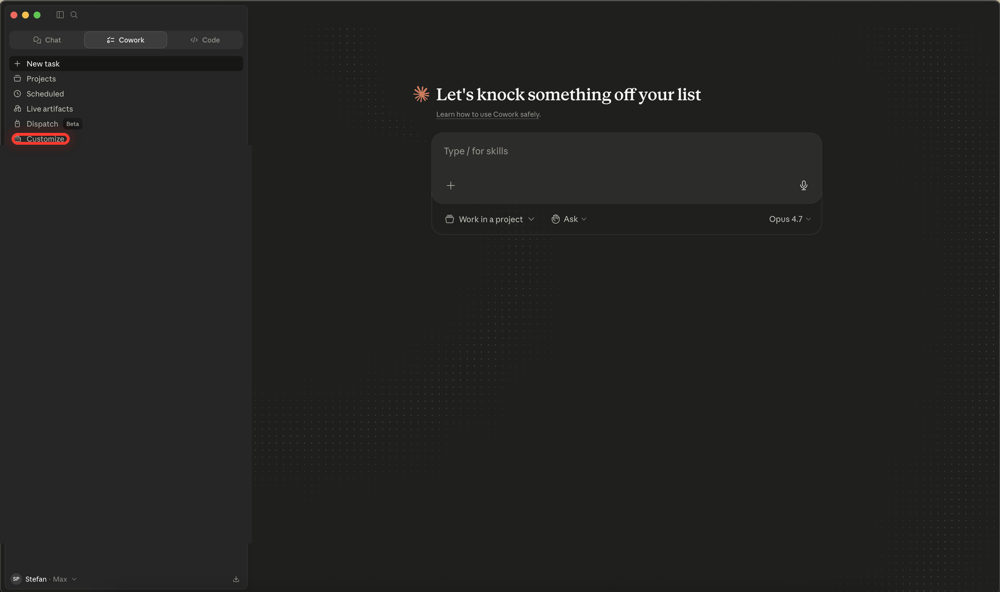
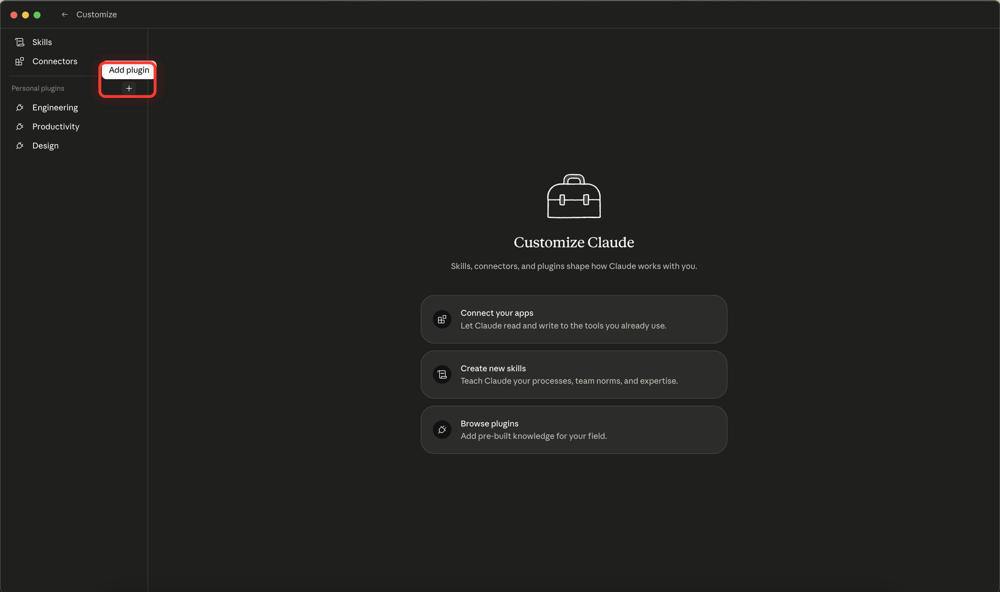
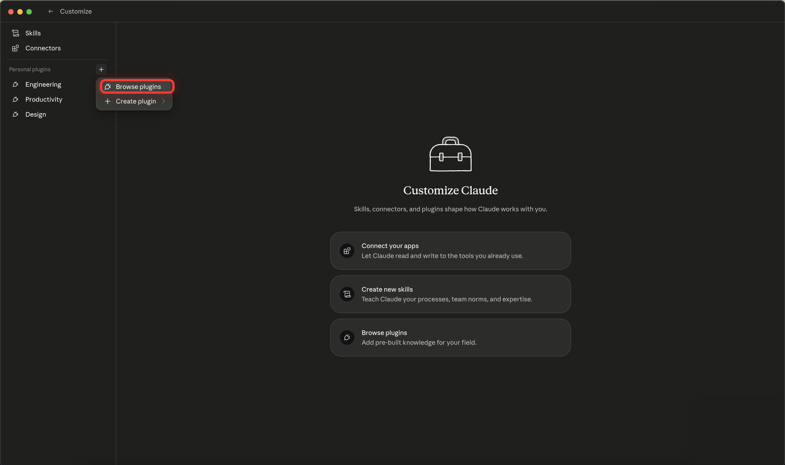
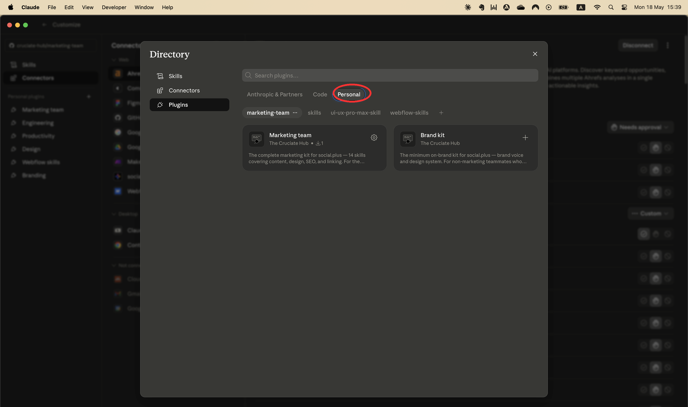
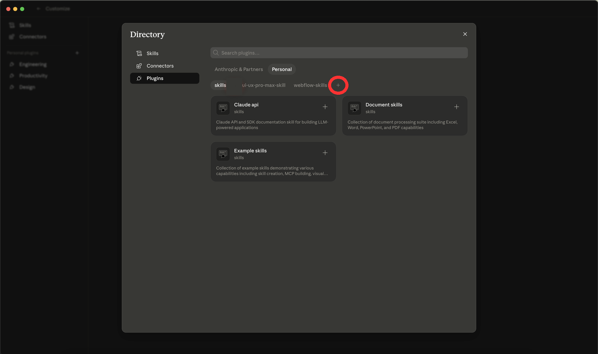
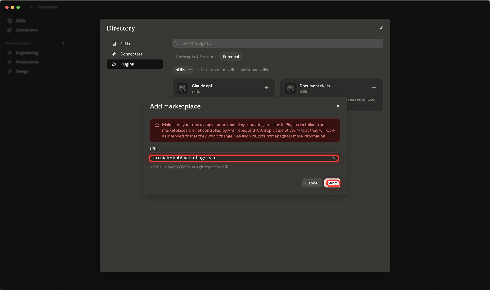
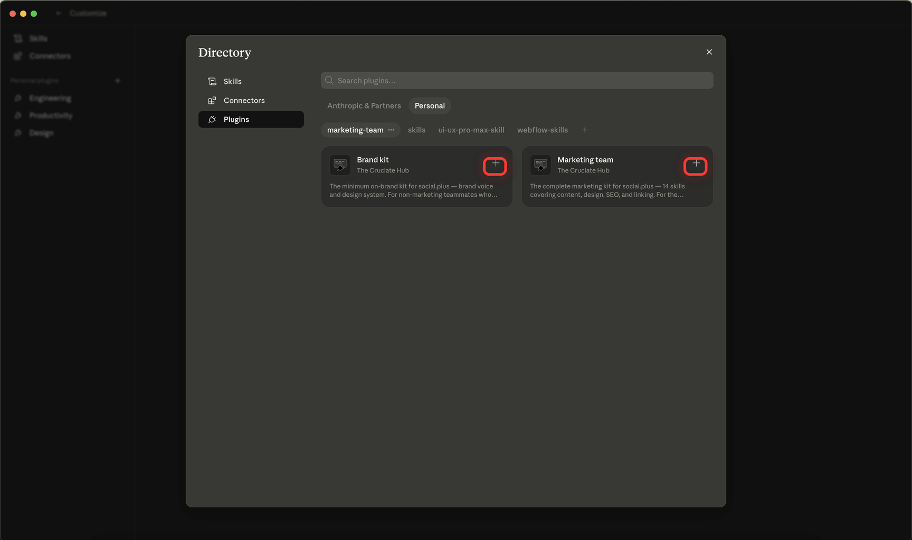
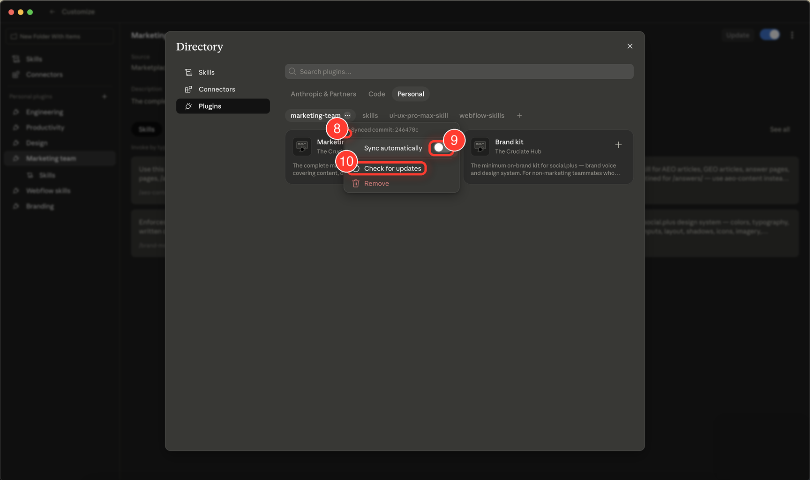

# Install the Marketing Team plugins

A visual, click-by-click walkthrough for installing the `cruciate-hub/marketing-team` marketplace in the Claude desktop app — then picking the right plugin (`marketing-team` or `brand-kit`) for your role.

You need the **Claude desktop app** (Mac or Windows) https://claude.com/download
The web app at claude.ai does not have the plugin marketplace.

---

## Step 1 — Open Customize

Open the Claude desktop app. In the left sidebar, click **Customize**.



---

## Step 2 — Open the "Add plugin" menu

In the left sidebar of the Customize screen, find the **Personal plugins** section. Hover over it and a **+** icon appears on the right. Click it.



---

## Step 3 — Click "Browse plugins"

A small dropdown opens with two options. Click **Browse plugins** (the top one). Do *not* click "Create plugin" — that's for building your own.



---

## Step 4 — Open the "Personal" tab

The **Directory** window opens on the **Anthropic & Partners** tab by default. Click the **Personal** tab so the marketplace row below shows your personal marketplaces (this is where the `marketing-team` marketplace will appear once it's added).



---

## Step 5 — Add the marketplace

Click the **+** icon. (Make sure **Plugins** is selected in the left sidebar.)



In the **URL** field of the dialog, paste:

```
cruciate-hub/marketing-team
```

Then click **Sync** in the bottom right. Claude will fetch the marketplace from GitHub — this takes a few seconds.



> **Note on the warning banner:** Claude shows a red warning about trusting third-party plugins. This marketplace is maintained by The Cruciate Hub (the team behind social.plus), so it's safe to proceed.

---

## Step 6 — Install your plugin

You're now back in the Directory and a new **`marketing-team`** pill is selected. You'll see two plugin cards:

- **Brand kit** — 2 skills: `brand-messaging` and `design-system`.
- **Marketing team** — 17 skills covering content, design, SEO, linking, publishing, and Webflow prototype migration.

**Install one, not both.** Click the **+** on the card that matches your role (see "Which one should I install?" below).



Claude installs the plugin and its skills. You're done — close the Directory window.

---

## Which one should I install?

| | Brand kit | Marketing team |
|---|---|---|
| **For** | Everyone outside the marketing team | The marketing team |
| **Skills** | 2 — `brand-messaging`, `design-system` | 14 — content, SEO, design, linking, formatting |
| **Use it when** | You occasionally write copy or build something visual and need to stay on-brand | You produce marketing content end-to-end: blog posts, landing pages, emails, customer stories, press releases, etc. |

---

## Stay up to date (do this once)

The skills load their content live from GitHub every session, so most updates reach you automatically. But the plugin manifest itself — new skills, renamed skills — needs a one-time auto-sync setup. Without it, you stay frozen on the version you installed and miss every future update.

Open the Directory again (the same window from Steps 4–6). Your installed plugin's pill is now selected at the top of the marketplace row. The next three steps all happen in one menu — see the highlighted callouts in the screenshot below.



### Step 7 — Open the plugin's settings menu

Click the **`···`** next to your installed plugin's pill (`marketing-team` or `brand-kit`) at the top of the marketplace row. A small menu opens.

### Step 8 — Toggle "Sync automatically" on

In the menu, find **Sync automatically** and click the toggle so it turns on. This is what makes future updates flow to you without manual intervention.

### Step 9 — Click "Check for updates"

Still in the same menu, click **Check for updates** to pull the latest version right now. You'll see the synced commit hash update at the top of the menu.

### Step 10 — Quit and reopen the Claude desktop app

Close the Claude desktop app completely (<kbd>⌘</kbd>+<kbd>Q</kbd> on Mac, or right-click the dock icon → Quit), then open it again. Plugins load on startup, so this is what makes the new skills actually available in your chats.

---

Now that auto-sync is on; new and improved skills will reach you on the next Claude desktop startup.
